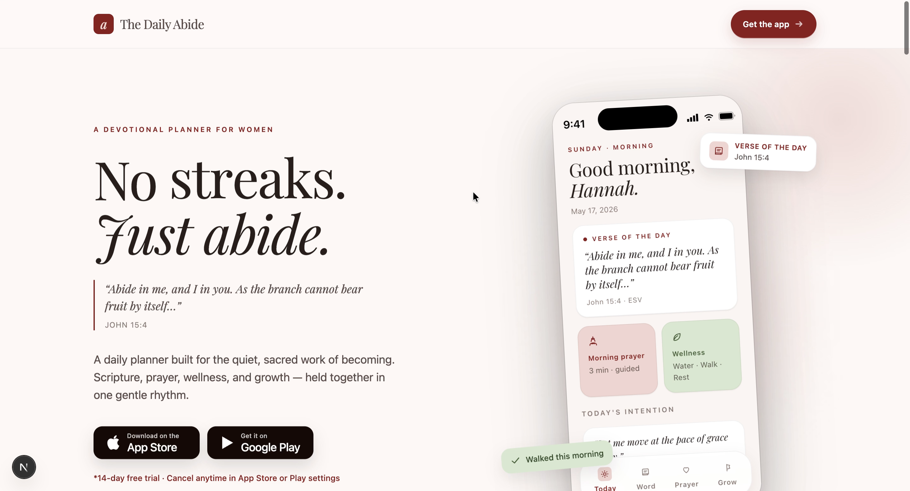
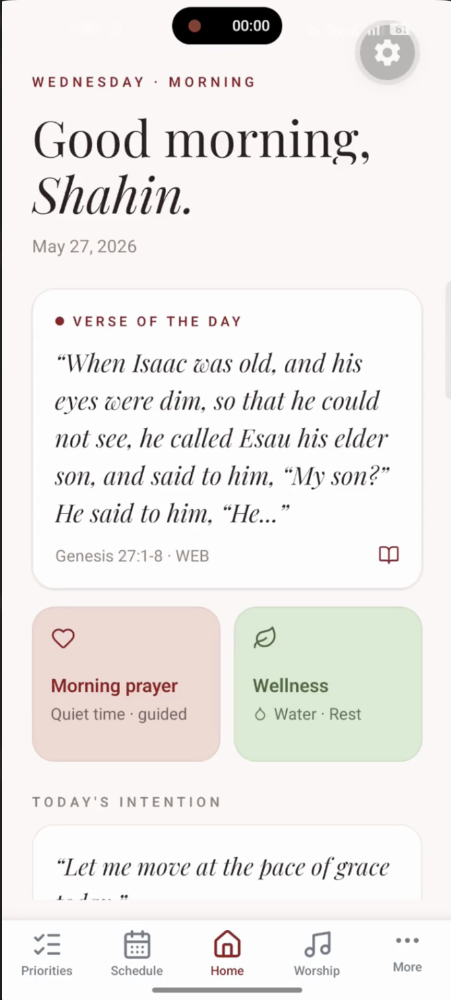

# ✨ The Daily Abide – Website & Mobile App

Improved The Daily Abide across web and mobile through marketing website redesign, UI/UX refinement, functionality improvements, QA, and production release support.

## 📌 Overview

The Daily Abide is a faith-based digital platform designed to help users build consistent spiritual, wellness, and daily-life habits.

The project included improving and redesigning the public marketing website alongside refining the existing mobile application, resolving functionality and production issues, and preparing the app for iOS and Android release.

My work covered both sides of the product — creating a stronger web presence while improving the usability, reliability, and production readiness of the mobile experience.

## 🎯 Objectives

- Redesign and improve the marketing website
- Strengthen visual consistency across web and mobile
- Improve responsive behavior and overall usability
- Resolve mobile UI and functionality issues
- Fix production build blockers
- Improve application stability and QA
- Prepare iOS and Android builds for production

## 🛠️ My Contributions

### 🌐 Marketing Website

- Redesigned and refined the existing marketing website
- Improved visual hierarchy, layouts, and overall UI/UX
- Built responsive experiences across desktop, tablet, and mobile
- Improved brand consistency throughout the website
- Refined content sections and user-facing interactions
- Improved frontend quality through linting and type checking
- Worked with the production Next.js architecture and supporting analytics/monitoring integrations

### 📱 Mobile App UI/UX

- Improved and polished multiple screens across the application
- Refined Home, Auth, Schedule, Prayer, Priorities, Wellness, Gratitude, Grocery, Menu Planner, Sermon Notes, Goals, and Steward experiences
- Improved keyboard and input visibility across forms and modals
- Fixed scrolling and interaction issues on smaller screens
- Improved visual consistency with The Daily Abide brand
- Refined spacing, cards, forms, actions, and mobile interactions

### ⚙️ Functionality & QA

- Improved schedule editing with a proper time picker
- Added duplicate time validation and improved schedule actions
- Added confirmation dialogs for destructive delete actions
- Fixed keyboard behavior across multiple forms and workflows
- Performed manual QA across major application screens
- Verified changes with TypeScript and Expo lint checks

### 🚀 Production & Release

- Diagnosed and resolved iOS production build blockers
- Fixed Hermes/Supabase compatibility issues affecting production builds
- Resolved native Expo audio-related iOS build failures
- Verified local iOS export and Hermes bundle generation
- Successfully completed EAS production builds for iOS and Android
- Submitted the iOS production build to App Store Connect / TestFlight
- Generated the Android `.aab` production build for Google Play submission

## ⚙️ Tech Stack

### Marketing Website

- **Framework:** Next.js 15
- **UI:** React 19
- **Language:** TypeScript
- **Styling:** Tailwind CSS
- **Components:** Radix UI
- **Analytics:** PostHog
- **Monitoring:** Sentry
- **Quality:** ESLint, TypeScript

### Mobile Application

- **Mobile:** React Native, Expo
- **Language:** TypeScript / JavaScript
- **Backend Integration:** Supabase
- **Build & Release:** EAS Build
- **Platforms:** iOS, Android
- **Distribution:** App Store Connect, TestFlight

## ✨ Key Features

- Faith-based daily habit experience
- Bible reading and prayer tracking
- Gratitude journaling
- Daily scheduling and priorities
- Wellness and water tracking
- Grocery and meal planning
- Budget and stewardship tools
- Goals and sermon notes
- Responsive marketing website
- Cross-platform iOS and Android application

## 📈 Outcome

Delivered improvements across both The Daily Abide marketing website and mobile application, creating a more polished and consistent experience across web and mobile.

The marketing website received UI/UX and responsive improvements, while the mobile application was refined, tested, stabilized, and prepared for production. The iOS build was successfully uploaded to App Store Connect/TestFlight, and the Android production `.aab` was successfully generated for Google Play submission.

## 🤝 Notes

This project was developed as part of a client-based collaboration, focusing on improving both the public-facing website and mobile product while preparing the application for production release.

## 👨‍💻 Author

**Shahinur Alam Bhuiyan**  
Frontend Developer (React / Next.js / TypeScript)

- 💼 Upwork: https://www.upwork.com/freelancers/~01bf24b7725d70b752
- 🌐 Portfolio: https://shahinuralambhuiyan.vercel.app
- 📧 Mail: shahinur.alam.bhuiyan01@gmail.com

## 🎥 Project Walkthrough

Explore the project in action through separate walkthroughs covering the marketing website and mobile application.

### 🌐 Marketing Website Walkthrough

▶️ [Watch on YouTube](https://youtu.be/rXFMEj5lXjU?si=65RmAI9RM80FinyA)

A walkthrough of The Daily Abide marketing website, highlighting the redesign, responsive experience, UI/UX improvements, and key website sections.

### 📱 Mobile App Walkthrough

▶️ [Watch on YouTube](https://youtube.com/shorts/nuySp5FDcMw?si=7dpKIDrYuX1cmf5V)

A walkthrough of The Daily Abide mobile application, showcasing key screens, UI/UX improvements, functionality updates, and the overall user experience.

## 🖼️ Preview

### Marketing Website

### Mobile Application

## 📄 License

This repository is not licensed for redistribution or reuse.  
All content is provided for demonstration and portfolio purposes only.

> © 2026 – The Daily Abide  
> _Website and Mobile App improvements by Shahinur Alam Bhuiyan_
